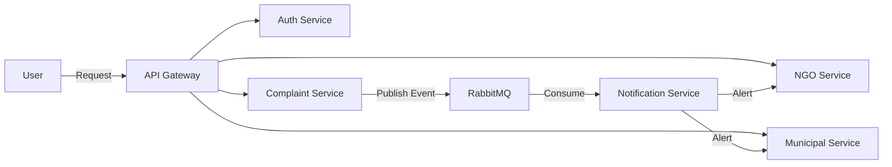

<div align="center">


🐾 Stray Animal Emergency Response Platform

### *Bridging the gap between citizens, NGOs, and municipal authorities — because every second counts.*

[Report Bug](https://github.com/your-username/your-repo/issues) · [Request Feature](https://github.com/your-username/your-repo/issues) · [⭐ Star this repo](#)

</div>

---------------------------------------------------------------------------------------------------------------------------------------------------------------

## 🚨 The Problem

Every day, stray animals are injured on city roads. The current system fails them:

- ❌ No centralized platform to report animal emergencies
- ❌ No direct communication channel between citizens, NGOs, and municipal authorities
- ❌ Manual phone calls and forwarding waste critical response time

> **The result?** Animals die waiting for help that never arrives in time.

--------------------------------------------------------------------------------------------------------------------------------------------------------------

## ✅ The Solution

A **microservices-based emergency response platform** that creates a unified digital ecosystem:

| Who | What they can do |
|-----|-----------------|
| 👤 **Citizens** | Instantly report an injured stray animal with photos and location |
| 🏥 **NGOs** | Receive real-time alerts and acknowledge complaints immediately |
| 🏛️ **Municipal Bodies** | Get targeted notifications based on city/area mapping |
| 🔧 **Admins** | Manage the entire ecosystem from a central dashboard |

---------------------------------------------------------------------------------------------------------------------------------------------------------------

## 🧠 System Architecture

```
┌─────────┐     ┌─────────────┐     ┌──────────────────────────────────────┐
│  Client │────▶│ API Gateway │────▶│  Auth | Complaint | NGO | Municipal  │
└─────────┘     └─────────────┘     └──────────────┬───────────────────────┘
                                                   │ Publish Event
                                            ┌──────▼──────┐
                                            │  RabbitMQ   │
                                            └──────┬──────┘
                                                   │ Consume
                                       ┌───────────▼────────────┐
                                       │  Notification Service  │
                                       └───────┬────────┬───────┘
                                               │        │
                                          Alert▼   Alert▼
                                          NGOs   Municipal
```



| Principle | Implementation |
|-----------|---------------|
| Service Design | Microservices — loosely coupled, independently deployable |
| Communication | Event-driven via RabbitMQ |
| Deployment | Fully Dockerized |
| Security | OAuth2 + Spring Security + JWT |

---------------------------------------------------------------------------------------------------------------------------------------------------------

## 🛠️ Tech Stack

| Category | Technology |
|----------|-----------|
| **Language** | Java 17 |
| **Framework** | Spring Boot, Spring Cloud |
| **Security** | Spring Security, OAuth2, JWT |
| **Database** | MongoDB |
| **Messaging** | RabbitMQ |
| **DevOps** | Docker, Docker Compose |
| **Service Discovery** | Eureka |
| **CI/CD** | GitHub Actions |

---------------------------------------------------------------------------------------------------------------------------------------------------------------

## 🔐 Security & RBAC

OAuth2-based authentication with JWT token authorization and Role-Based Access Control:

| Role | Permissions |
|------|------------|
| `USER` | Submit emergency reports |
| `NGO` | Receive notifications, acknowledge complaints |
| `MUNICIPAL` | Municipal authority dashboard access |
| `ADMIN` | Full system control |

---------------------------------------------------------------------------------------------------------------------------------------------------------------

## 🧩 Microservices Breakdown

<details>
<summary><b>1️⃣ API Gateway Service</b></summary>

Central entry point for all incoming requests. Handles routing, authentication, and security enforcement.
</details>

<details>
<summary><b>2️⃣ Auth Service</b></summary>

Manages user registration and login. Issues OAuth2-compliant JWT tokens for secure access.
</details>

<details>
<summary><b>3️⃣ Complaint Service</b></summary>

Accepts accident reports from citizens. Stores animal details, uploaded images, and location data.
</details>

<details>
<summary><b>4️⃣ NGO Service</b></summary>

Manages NGO profiles and filters relevant organizations based on city and location.
</details>

<details>
<summary><b>5️⃣ Municipal Service</b></summary>

Maintains municipal authority data with city-wise mapping for targeted notification routing.
</details>

<details>
<summary><b>6️⃣ Notification Service</b></summary>

Listens to RabbitMQ events and dispatches real-time alerts to appropriate NGOs and municipal teams.
</details>

---------------------------------------------------------------------------------------------------------------------------------------------------------------

## 📍 Location-Based Matching — How It Works

```
User submits complaint
        │
        ▼
Extract city/location from complaint
        │
        ▼
Fetch nearby NGOs & municipal bodies
        │
        ▼
Publish event to RabbitMQ
        │
        ▼
Notification Service triggers targeted alerts
        │
        ▼
✅ Minimum response time. Maximum impact.
```

---

## 🚀 Getting Started

### Prerequisites

- [Docker & Docker Compose](https://docs.docker.com/get-docker/)
- [Java 17](https://adoptium.net/)
- [MongoDB](https://www.mongodb.com/try/download/community)

### Run Locally

```bash
# Clone the repository
git clone https://github.com/your-username/your-repo-name.git

# Navigate into the project directory
cd your-repo-name

# Start all services
docker-compose up --build
```

> 🎉 All microservices will spin up automatically in isolated containers.

---------------------------------------------------------------------------------------------------------------------------------------------------------------

## 🐳 Docker Setup

Each microservice runs in its own isolated container:

- ✅ Independent scaling per service
- ✅ Consistent environments across dev, staging, and production
- ✅ AWS-ready cloud deployment out of the box

---

## 📦 Roadmap

- [ ] 📱 Mobile App (Android & iOS)
- [ ] 🗺️ Live Google Maps Tracking
- [ ] 📊 Admin Analytics Dashboard
- [ ] 🔔 SMS / WhatsApp Alert Integration
- [ ] 🤖 AI-based Injury Severity Detection from Images

---------------------------------------------------------------------------------------------------------------------------------------------------------------

## 🤝 Contributing

Contributions are welcome and appreciated!

1. Fork the repository
2. Create your feature branch: `git checkout -b feature/AmazingFeature`
3. Commit your changes: `git commit -m 'Add some AmazingFeature'`
4. Push to the branch: `git push origin feature/AmazingFeature`
5. Open a Pull Request

---------------------------------------------------------------------------------------------------------------------------------------------------------------

## 💡 Why This Project Matters

> *"The best use of technology is when it saves a life."*

- 🐶🐱 Directly saves stray animal lives
- ⏱️ Drastically reduces emergency response time
- 🏛️ Enables transparent coordination between NGOs and city authorities
- 🌍 Real-world social impact built on modern software engineering

---------------------------------------------------------------------------------------------------------------------------------------------------------------

## 👨‍💻 Author

**Manas Rastogi**

*Backend / Java Microservices Developer*

[](https://linkedin.com/in/your-profile)
[](https://github.com/your-username)

------------------------------------------------------------------------------------------------------------------------------------------------------------------------------------------------------------

<div align="center">

⭐ **If this project resonates with you, please give it a star and share it.**

*"Together, we can use technology to make cities more compassionate."* ❤️

</div>
